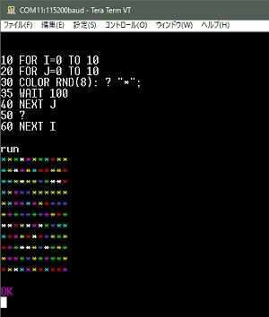

## 豊四季タイニーBASIC for Arduino STM32 V0.5



※本ソースにはビデオ出力・PS/2キーボード対応のブランチ版があります(最終的に合流予定)。  
https://github.com/Tamakichi/ttbasic_arduino/tree/ttbasic_arduino_ps2_ntsc  

本プログラムは、下記オリジナル版をArduino STM32向けに移植・機能版です.  
STM32F103C8T6搭載のBlue Pillボード、Black Pillボードでの動作を確認しています.  
※機能の大幅追加のため、Arduino MEGEは非対応となりました.  

- オリジナル版配布サイト  
 https://github.com/vintagechips/ttbasic_arduino  
 関連情報 [電脳伝説 Vintagechips - 豊四季タイニーBASIC確定版](https://vintagechips.wordpress.com/2015/12/06/%E8%B1%8A%E5%9B%9B%E5%AD%A3%E3%82%BF%E3%82%A4%E3%83%8B%E3%83%BCbasic%E7%A2%BA%E5%AE%9A%E7%89%88/)

**「豊四季タイニーBASIC」**の著作権は開発者**のTetsuya Suzuki**氏にあります.  
プログラム利用については、オリジナル版の著作権者の配布条件に従うものとします.  
著作権者の同意なしに経済的な利益を得てはいけません.  
この条件のもとで、利用、複写、改編、再配布を認めます.  

**修正内容**
- ラインエディタ部の差し換え  
 オリジナルのラインエディタ部分をフルスリーンテキストエディタに差し換えました.  
 ターミナル上で昔のBASICっぽい編集操作を出来るようにしました.  

- コマンドの追加  
  - **RENUM** ：行番号再割り当て  
  - **CLS** ：画面クリア  
  - **LOCATE**：カーソル移動  
  - **COLOR**： 文字色の指定  
  - **ATTR**：文字装飾の指定  
  - **WAIT**：時間待ち  
  - **VPEEK**：スクリーン位置の文字コード参照  
  - **CHR$()**、**HEX$()**、**BIN$()**、**ASC()**、**INKEY()** 関数の追加  
  - **TICK()** 関数、**RESETTIK**の追加  
  - **?**：**PRINT**文の省略系を追加  
  - **GPIO**、**OUT**、**IN**、**ANA**、**SHIFTOUT**、**SHIFTIN**：GPIO利用コマンドの追加  
  - **I2CW**、**I2CR**：I2C利用コマンドの追加  
  - **POKE**、**PEEK**：メモリ領域参照コマンドの追加  
  - **DATE**、**SETDATE**、**GETTIME**: 内蔵RTC利用コマンド追加  
  - **SAVE**、**LOAD**： 内部フラッシュメモリへのプログラム保存機能の追加  
  - **EEPFORMAT**,**EEPWRITE**,**EEPREAD**コマンドの追加(仮想EEPROM機能)  
  - **AND**、**OR**、!、~、!の追加  
- 文法の変更  
  - 定数の16進数表記対応(例 $1234,$AB)  
  - 命令文区切りを';'から':'に変更  
  - **PRINT**文の行継続を';'でも可能に変更  
  - **PRINT**文の数値桁指定#nのnにマイナス値指定時、空白ではなく0埋め出来るように追加  
  - **IF**文の不一致判定を"!="でも可能に変更、ELSE文対応    
  - 演算子 剰余計算'%'、シフト演算子 '>>'、'<<'を追加  
  - 論理積・論理和 '|'、'&'ビット演算子を追加  
  - **STOP**命令を**END**に変更    
  - **SIZE**を**FREE**に変更  
  - 文字列囲みにシングルクォーテーションを利用出来ないように変更  
  - コメントをシングルクォーテーション(')での記述出来るように修正  
  - 配列の連続値設定を可能した(例: @(0)=1,2,3,4,5)    
  - GOTO,GOSUBをラベル対応(例: GOTO "ラベル" ダブルクォーテーション囲み)  
  - INPUT文の入力改善、オーバーフローエラー回避対策追加    
- 編集機能の変更  
  - 実行中プログラムの中断を**[ESC]**を2回押し、**[CTRL-C]**に変更  
- その他  
  - プログラム領域を256バイトから2048バイトに拡大  
  - 配列サイズを32から100に拡大  
  - エラーメッセージ**Illegal value**の追加  
  - エラーメッセージ**Out of range value**の追加  
  - エラーメッセージ**Program not found**の追加  
  - 定数:HIGH、LOW、PA00、PA01、..、PC15のピン名の追加  

**※本スケッチの利用には別途、下記のライブラリが必要です.**  
 - mcursesライブラリ  
   https://github.com/ChrisMicro/mcurses  
 - Arduino STM32 内部フラッシュメモリ書き込みライブラリ  
   https://github.com/Tamakichi/ArduinoSTM32_TFlash  

## フルスリーンテキストエディタの機能
※利用にはTeraTerm用のシリアル接続可能なターミナルソフトが必要です.  

**スクリーンサイス**  
80列ｘ25行  

**利用可能キー**  
- [←][→][↑][↓] ： カーソル移動 カーソルキー  
- [Delete]、[CTRL-X] ：カーソル位置の文字削除  
- [BackSpace]：カーソル前の文字削除と前に移動  
- [PageUP]、[PageDown]、[CTRL-R]：画面の再表示  
- [HOME]、[END]：行内でカーソルを左端、右端に移動  
- [INS]：挿入・上書きのトグル切り替え  
- [Enter]：行入力確定  
- [ESC]2回押し、[CTRL-C]：実行プログラムの中断
- [CTRL-L]：画面のクリア

## 追加・修正コマンドの説明
[リファレンスマニュアル(nmanual.pdf)](./manual.pdf)に記載しています(ただし追加・修正中)  
(リンクを直接クリックして閲覧すると表示が遅いです。ダウンロードして閲覧して下さい)  

## サンプルプログラム
### 画面に色付き文字表示
```
10 FOR I=0 TO 10
20 FOR J=0 TO 10
30 COLOR RND(8): ? "*";
35 WAIT 100
40 NEXT J
50 ?
60 NEXT I
```

### ボード上のLEDの点滅  
```
10 P=PC13
20 GPIO P,OUTPUT
30 OUT P,HIGH
40 FOR I=1 TO 10
50 OUT P,LOW
60 WAIT 300
70 OUT P,HIGH
80 WAIT 300
90 NEXT I
```

### アナログ値表示
```
10 CLS
20 GPIO PB01,ANALOG
30 A=ANA(PB01)
40 LOCATE 5,5: ? A; "     "
50 GOTO 30
```
### 配列の連続設定
```
10 @(1)=1,2,3,4,5,6,7,8
20 FOR I=1 TO 8
30 ? "@(";I;")=";@(I)
40 NEXT I
```

### シフト演算
```
10 A=1
20 FOR I=0 TO 16
30 ? HEX$(A<<I,4)
40 NEXT I
```

### ラベルの利用
```
100 GOSUB "SUB01"
110 GOSUB "SUB02"
120 N=0
130 "LOOP"
140 PRINT "N=";N
150 N=N+1:IF N<5 GOTO "LOOP"
160 END
170 "SUB01"
180 PRINT "SUB01"
190 RETURN
200 "SUB02"
210 PRINT "SUB02"
220 RETURN
```

## 以降はオリジナルのドキュメントです


TOYOSHIKI Tiny BASIC for Arduino

The code tested in Arduino Uno R3.<br>
Use UART terminal, or temporarily use Arduino IDE serial monitor.

Operation example

&gt; list<br>
10 FOR I=2 TO -2 STEP -1; GOSUB 100; NEXT I<br>
20 STOP<br>
100 REM Subroutine<br>
110 PRINT ABS(I); RETURN

OK<br>
&gt;run<br>
2<br>
1<br>
0<br>
1<br>
2

OK<br>
&gt;

The grammar is the same as<br>
PALO ALTO TinyBASIC by Li-Chen Wang<br>
Except 3 point to show below.

(1)The contracted form of the description is invalid.

(2)Force abort key<br>
PALO ALTO TinyBASIC -> [Ctrl]+[C]<br>
TOYOSHIKI TinyBASIC -> [ESC]<br>
NOTE: Probably, there is no input means in serial monitor.

(3)Other some beyond my expectations.

(C)2012 Tetsuya Suzuki<br>
GNU General Public License
