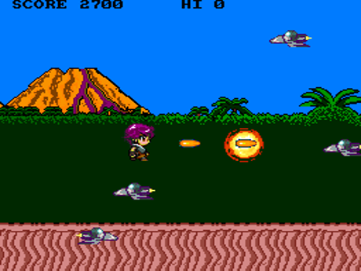
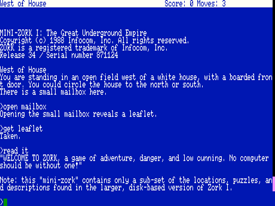
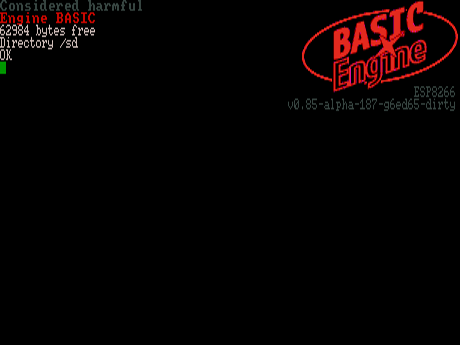

#  BASIC Engine Firmware (ALPHA!)

The BASIC Engine is a very low-cost single-board home computer with advanced
2D color graphics and sound capabilities, roughly comparable to late-1980s
or early-1990s computers and video game consoles.  It can be built at home
without special skills or tools and using readily available components for
under 10 Euros in parts, or mass-produced for even less.

More information on the hardware can be found in the
[BASIC Engine PCB](https://github.com/uli/basicengine-pcb) repository.
Demos can be found at the [BASIC Engine demos](https://github.com/uli/basicengine-demos)
repository.

## Screenshots





## Videos

Click on the thumbnails below to watch some demo videos:
[](http://www.youtube.com/watch?v=WEeHVyWH8rQ "BASIC Engine Shmup Demo")
[](http://www.youtube.com/watch?v=0ZsucdE6l2o "BASIC Engine Tetris Demo")

## Firmware

This firmware contains a basic operating system and BASIC interpreter
("Engine BASIC") that allows the BASIC Engine to be used as a stand-alone
computer programmable in the BASIC language.  It provides easy access to the
hardware's capabilities as well as numerous other features.

### Graphics and sound

- 256-color text and graphics at resolutions from 160x200 up to 460x224
  (PAL: 508x240) pixels
- Software sprites (up to 32 sprites sized up to 32x32 pixels).
- Scrollable tiled background graphics engine with up to four layers.
- Wavetable synthesizer and *PLAY* command that renders music in MML format.
- Loading and saving of PCX image files to and from video memory.
- Various text fonts built-in, including an ATI 6x8 font (for up to 76 (PAL:
  84) characters per line) and PETSCII.
- Direct manipulation of video memory and controller registers possible,
  permitting higher-color screen modes, custom resolutions and other
  video effects.

### Special BASIC language features

- Structured programming constructs (*DO*/*LOOP*, *WHILE*/*WEND*,
  *IF*/*THEN*/*ELSE*/*ENDIF* blocks).
- Labels and named procedures with local variables.
- Numbers are double-precision floating point.
- String and numeric list types (particularly useful for game programming).
- Escape codes for *PRINT*, similar to the control characters in Commodore BASIC.
- Event handlers (sprite collision, end-of-music, errors, game controller input).

### Development features

- "Screen editor" similar to Commodore BASIC, allowing direct manipulation
  of on-screen code and commands, while also permitting scrolling within the
  program in memory.
- Syntax highlighting and automatic indentation in *LIST* command.
- Loading of programs with or without line numbers.

### Hardware support

- ESP8266 CPU core running at 160 MHz, ca. 63kB free memory for BASIC
  applications.
- Files can be stored on FAT32 file systems with long file names on MicroSD
  card as well as the internal flash memory.
- PlayStation controller support.
- Support for PS/2 and PS/2-compatible USB keyboards (US, Japanese and
  German layouts supported).
- Access to custom hardware add-ons via the 16-pin GPIO extender or I2C bus.

### Network support

- Separate build that provides networking capabilities (cannot be used with
  tiled BG/sprites and wavetable synthesizer due to resource constraints;
  both builds can, however, be installed in flash at the same time)

### Other features

- Z-code interpreter for playing interactive fiction games.
- ASCII text editor.
- Firmware update from SD card.
- Customizable color scheme, start-up screen mode and font..
- Switchable video luminance filter provides sharp high-contrast graphics on
  LCD screens when turned off and avoids color artifacts on old CRT screens
  when turned on.
- Automated test suite adapted from Bywater BASIC.

### Binary releases

Binaries are available in the [release section](https://github.com/uli/basicengine-firmware/releases).
They can be uploaded to the system via the serial port, using esptool:

```
esptool -cd ck -cb 921600 -cp /dev/ttyUSB0 -ca 0 -cf ttbasic-<version>.bin
```

If a version of Engine BASIC is already installed, the firmware can be
updated from SD card using the command

```
FLASH "ttbasic-<version>.bin"
```

### Compiling the source code

The project Makefile uses the Arduino builder to compile the system.

The standard build requires a [special ESP8266 Arduino
core](https://github.com/uli/Arduino_nowifi) without networking support that
contains a BASIC Engine build target.

The networked version can be built with the standard ESP8266 Arduino core.

### Origins
The software is a heavily modified version of
[TOYOSHIKI Tiny BASIC for Arduino STM32](https://github.com/Tamakichi/ttbasic_arduino/tree/ttbasic_arduino_ps2_ntsc).

Engine BASIC is based on its BASIC interpreter, PS/2 keyboard driver and
text screen subsystem.

