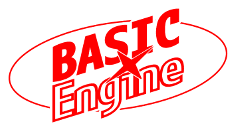
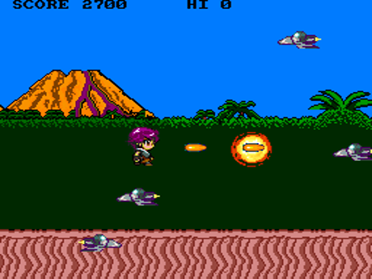
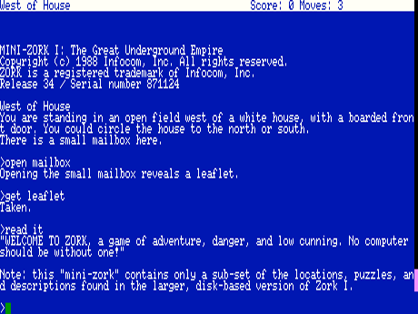
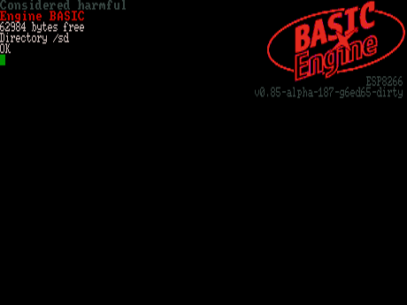

#  BASIC Engine Firmware (ALPHA!)

[This branch is under development!]

The [BASIC Engine](https://basicengine.org/) is a BASIC programming
environment designed for low-cost single-board computers that features advanced
2D color graphics and sound capabilities, roughly comparable to early to
mid-1990s computers and video game consoles.  It can be easily installed on
an SD card and immediately used on a variety of Allwinner H3,
H2+, H616 and H313 boards often costing less than 20 Euros.

This branch implements a version of Engine BASIC for Allwinner H3 and
H616/H313 SoCs that runs in the Jailhouse bare metal hypervisor, alongside a Linux
kernel that provides it with input and file system services. (This variety
is called "BASIC Engine RX".)

It can also be built with an SDL2 backend that allows it to run on a large
number of embedded platforms on top of a Linux kernel, as well as Linux,
MacOS and Windows desktop computers. (This variety is called "BASIC Engine
LT" and is currently the preferred way to use Engine BASIC.)

More information on can be found on the [BASIC Engine web site](https://basicengine.org)
and the [BASIC Engine web forum](https://betest.freeflarum.com/).

Demo programs can be found at the [BASIC Engine demos](https://github.com/uli/basicengine-demos)
repository.

## Screenshots

[These screenshots are from the original, custom-built BASIC Engine hardware.]

## Videos

[These videos are from the original, custom-built BASIC Engine hardware.]

Click on the thumbnails below to watch some demo videos:

## Downloads

Pre-compiled SD card images and versions for desktop computers can be
downloaded from https://basicengine.org/git_builds/

## Compiling

To build an SDL2-based version for single-board computers ("BASIC Engine
LT") or a bare-metal hypervisor-based version ("BASIC Engine RX"), it is
recommended to use the [BASIC Engine buildroot](https://github.com/uli/basicengine-buildroot).

To build an SDL2-based version for desktop computers, run `./configure.sh`,
then `ninja -f build.ninja.sdl`. Building for Linux, MacOS and Windows
systems has been tested. A suitable SDL2 development environment needs to be
installed first, and ninja and Python3 with the polib library have to be
available.
